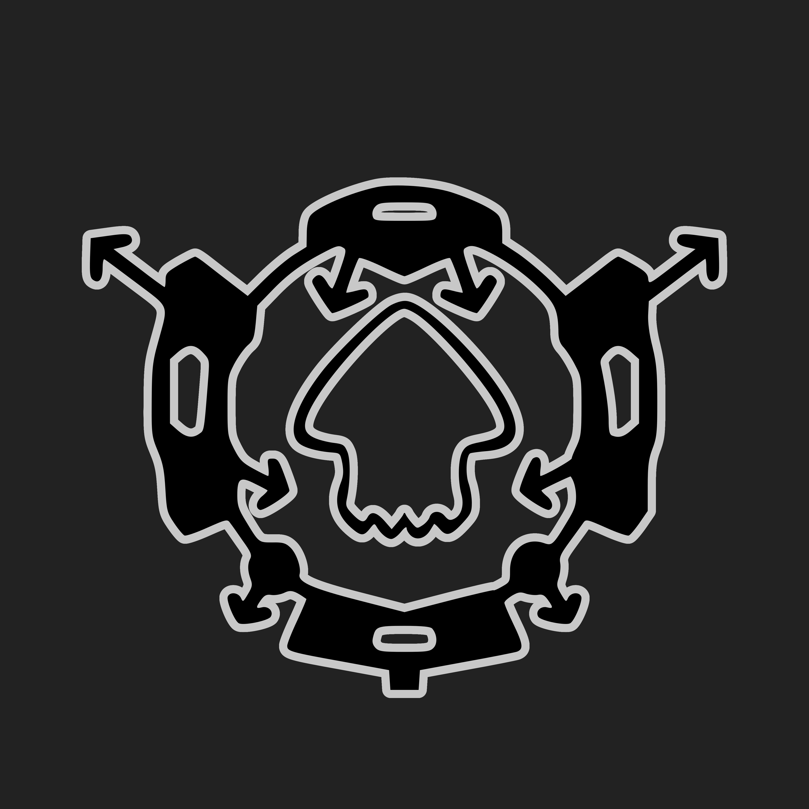

<b style="inline-block">Click on the icons for links!</b>

 

> ⚠️ This library is a WIP and only used internally for SDL Foundation projects currently.

# LibMacchiato - Front-end for the Macchiato modding environment

**What is Macchiato**: Macchiato is an experimental and opinionated modding environment developed by splatoon1enjoyer in the SDL Foundation that provides a standardized module system interface and pipeline for running and patching code of Wii U games via homebrew software and plugins as well as executing callbacks.

**What is LibMacchiato**: LibMacchiato is the front-end of the environment and a patching framework that provides all of the actual module and patch interfaces used to patch Wii U applications. Additionally, it includes utilities for your everyday needs for parsing ELF files, managing files, searching for executables and more. It can either be used with the Macchiato back-end, which handles the application of patches, creating menus for toggling modules, GUI rendering and more, or standalone for your own patching needs. Features of LibMacchiato include:

- Inline Hooks
- Inline Assembly Hooks
- Trampoline Hooks
- Trampoline Hook Optimization
- Codecaves (WIP)
- PowerPC assembler (WIP)
- Filesystem management (FS utilities for reading, writing & managing files)
- ELF parsing (WIP)
- ...and more

LibMacchiato lives in the second layer of Silverlight. The layers of Silverlight are:

- Layer 4: LibSilverlight - Framework for making Silverlight plugins
- Layer 3: Silverlight - The back-end of the Silverlight modding environment, an environment specifically designed for making Splatoon mods.
- **Layer 2: LibMacchiato** - The user-facing library of the Macchiato modding environment that provides all of the patching utilities.
- Layer 1: Macchiato - The back-end of Macchiato.

## Table of contents

 - [Goal](#goal)
 - [Documentation](#documentation)
 - [Links](#links)
 - [Donating](#donating)
 - [License](#license)
 - [Download](#download)
 - [Building](#building)
 - [Development](#development)
 - [Credits](#credits)

## Goal

The main goal of this framework is to provide all of the utilities a person would need to patch a Wii U application. Additionally, LibMacchiato aims for:

- Optimal performance for running on a single thread (performance over memory)
- Data-oriented, declarative and modular design when it makes sense
- Easy integration in any Wii U game

## Documentation

Documentation will become available soon.

## Links

- [Website](https://sdlfoundation.com)
- [Discord](https://discord.gg/K5FaeRtjrj)

## Donating

TODO

## License

LibMacchiato is licensed under the GNU Affero General Public License 3.0. Exempt from this licensing are libraries and other dependencies in the library directory (`Dependencies/`), each one licensed respectively according to their LICENSE file(s).

## Building

TODO

## Development

TODO

## Credits

- splatoon1enjoyer: Lead developer
- [libkernel](https://github.com/wiiu-env/libkernel): syscall abstractions for writing to Wii U's memory without MMU overhead
